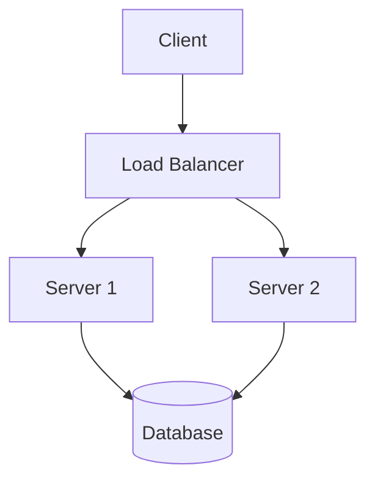

# 🚀 AlgoSystem-Engineer

---

## 🧠 About

This is a **structured engineering system** to master:

- Data Structures & Algorithms  
- System Design  
- Real-world problem solving  

---

## 🗺️ Learning Philosophy

> Not grinding 500 problems.  
> Building **engineering thinking + scalability mindset**.

---

## 📂 Structure

- `dsa/` → Patterns + problems  
- `system-design/` → Architecture thinking  
- `projects/` → Java simulations  
- `docs/` → diagrams & notes  

---

## 🧩 Architecture Example

🚀 Featured Implementations
- Rate Limiter (Token Bucket)
- URL Shortener
- Payment Simulation

⭐ Why this repo stands out
- Structured like real engineering systems
- Focus on tradeoffs + scalability
- Clean Java implementations

🧠 Goal
Become someone who can:
- Solve problems
- Design systems
- Think like a senior engineer

⭐ Star this if you're building real engineering skills.
